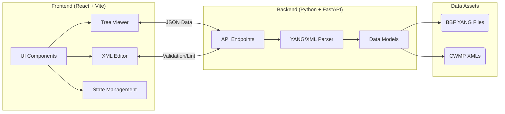

# システムアーキテクチャ

本アプリケーション（BBF DataModel Viewer & Editor）は、フロントエンドとバックエンドが分離されたモダンなWebアーキテクチャで構成されています。

## 全体構成

## バックエンド (Backend)

FastAPIを利用し、Broadband Forumが提供するCWMP XML定義およびYANG定義モデルをメモリ上にロードし、フロントエンドに最適化されたJSONを返却します。
特に、データ構造が巨大なため、必要に応じた遅延ロードやページネーション機能を備えることでパフォーマンスを最適化しています。

## フロントエンド (Frontend)

ReactによるSPA構造です。ユーザーは膨大なデータモデルのツリーをブラウジングし、必要なパラメータを検索できます。
Editモードでは、ユーザー入力に応じて TR-069 の `SetParameterValues` 向けの SOAP XMLペイロードをリアルタイムに自動生成します。

## E2Eテスト (Playwright)

フロントエンドとバックエンドを統合したテストシナリオはPlaywrightによって実行されます。ブラウザ上のUI操作をエミュレートし、ツリーの展開やエディタの入力、そして生成されるXMLの妥当性を自動検証します。
